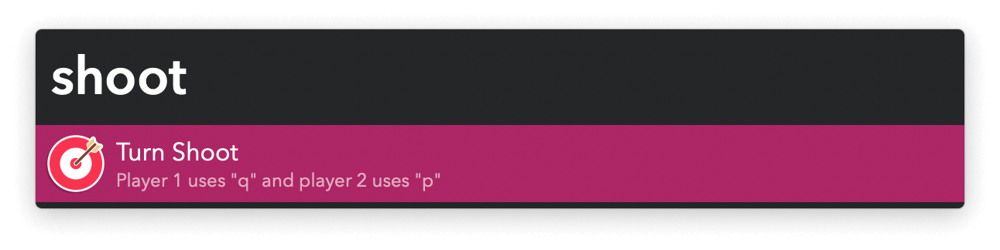

#  Turn Shoot Alfred Workflow

A reflexes game for two players

[⤓ Install on the Alfred Gallery](https://alfred.app/workflows/vitor/turn-shoot)

## Usage

Start a two-player reflexes game via the `shoot` keyword.

After a few seconds the workflow will tell you to react, and the first player to press their key wins. Don’t jump the gun or the victory will go towards your opponent.

